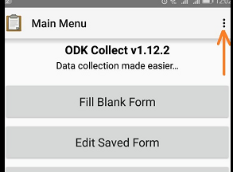

```{r knitr_init, echo=FALSE, cache=FALSE}
library(knitr)
library(rmdformats)

#### Global options
options(max.print="75")
opts_chunk$set(echo=FALSE,
	             cache=TRUE,
               prompt=FALSE,
               tidy=TRUE,
               comment=NA,
               message=FALSE,
               warning=FALSE)
opts_knit$set(width=75)
```


Systems and tools needed

  * [Yambase](https://yambase.org). This is the global yam breeding database. Use this system to generate the crossing plan
  * Mobile app. Developed using ODK framework. Used for data collection
  * Interactive dashboard. For vizualization and querying of collected data
  

<b>What you need:</b>

  * Android tablet/ smart phone
  * Zebra ZQ520 - Mobile printer and its labels
  * Computer with internet access
  
<br>

## Crossing plan

Follow the yambase link below to create a crossing plan

https://solgenomics.github.io/sgn/03_managing_breeding_data/03_06.html##cross-wishlist

<br>


## Mobile app setup

In the Android tablet, visit playstore to download and install the following

  * [ODK collect](https://play.google.com/store/apps/details?id=org.odk.collect.android&hl=en)
  * [ODK Sensors Framework](https://play.google.com/store/apps/details?id=org.opendatakit.sensors&hl=en)
  * ODK printer driver (contact admin)

Open the ODK collect on the tablet. Go to Menu as shown in the fig below




## Record information

#### Planting

#### Bagging

#### Pollination

#### Fruit set

#### Fruit harvest

#### Seed processing

#### Sowing

#### Germination

#### Transplanting

#### 