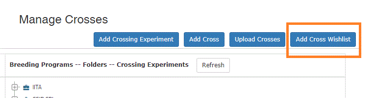
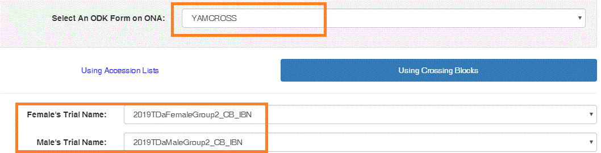
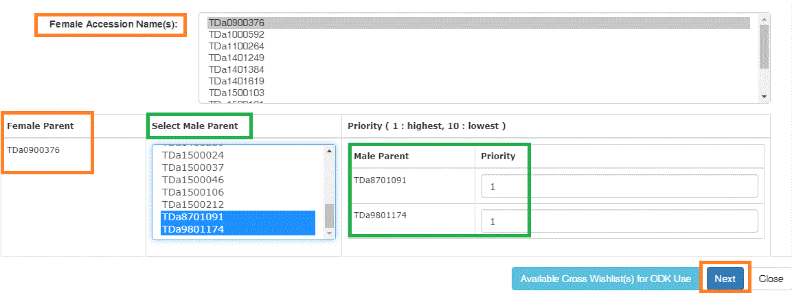
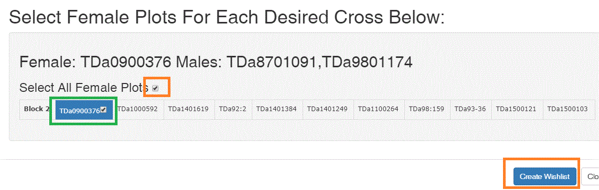
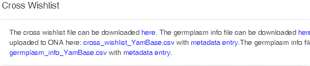
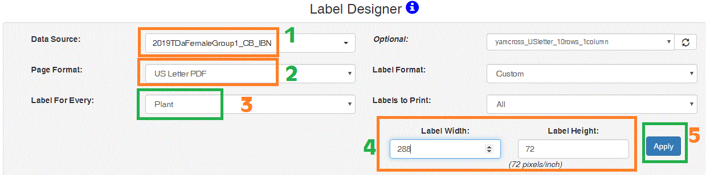
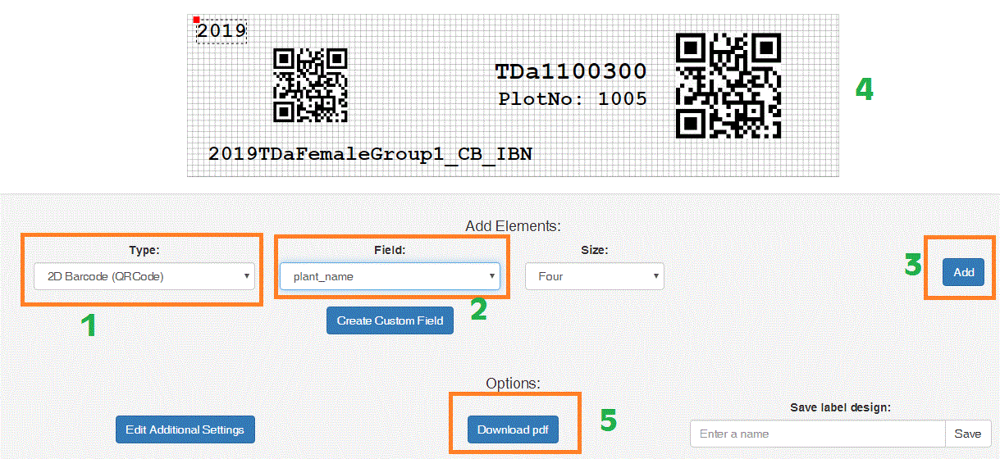
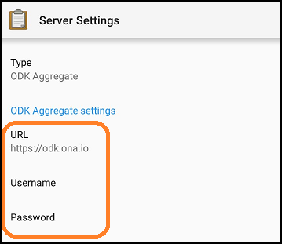
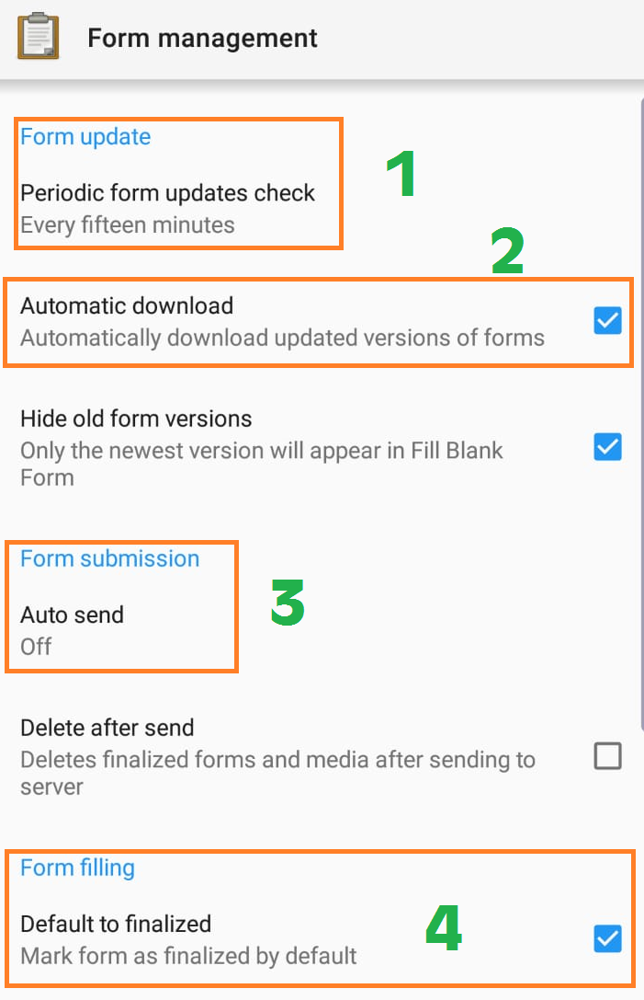

Untitled
================

# Getting started

## Accounts and logins to

  - [Yambase](https://yambase.org) or
    [yambase-test](https://yambase-test.sgn.cornell.edu/). The global
    yam breeding database

  - [ONA](https://ona.oi) server

  - [Yamcross](http://btract.sgn.cornell.edu/yamcross/) or
    [Yamcrosstest](http://btract.sgn.cornell.edu/yamcrosstest/)
    dashboard.

## Items needed

  - Android tablet/ smart phone

  - Mobile printer (eg. Zebra ZQ520) and labels

  - Computer with internet access

# Trial/ pollination block

The trials used in yamcross must include number of plants per plot and
the trial planting dates

To check if these information is included, in <b>yambase</b>, go to the
<b>trial details </b>page

 To add planting date, click on “Edit Trial
Details”, select the planting date in the date section.

 

<b>Plants per plot</b>

# Crossing plan or wishlist

In yambase, go to <b> Manage menu</b> then <b> Crosses</b>

    Click on <b> “Add Cross Wishlist”</b> as shown

 

<b> Select Trials</b>

    a. Select the YAMCROSS form as shown in the figure

2.  Select the Female Trial and

3.  Select the Male Trial as shown

 

<b> Select Accessions</b>

    a. Under the Female Accessions Names, select the Female
accessions

2.  For each Female accession, select the Male accessions in order of
    priority as indicated

3.  Click <b>Next</b>

 

<b>Select Female Plots</b>

    In the resulting dialog box, check the select all female plots
or scroll to check one by one female plot

Then click on <b> Create Wishlist</b>

 

<b>Submit Wishlist</b>

    If all goes well, the message in the fig should be displayed
next. Otherwise repeat the steps
above

#### To explore other different ways of creating a crossing plan, follow the yambase link <https://solgenomics.github.io/sgn/03_managing_breeding_data/03_06.html##cross-wishlist>

 

# Field plants barcode labels

In <b>yambase</b>, go to <b>manage menu</b> then <b>Label Designer</b>

1.  Data source - select the Trial

2.  Select page format

3.  Label entry level - select plants

4.  Set the label width and label height.

Click apply

 

1.  To create a barcode, under Type, select 2D barcode

2.  Under Field, select plant\_name, then click Add

To add label on the barcode, under Type in step (a) above select Text,
then plant\_name under Field and click Add.

3.  Download the barcode labels as pdf file by clicking the download
    button

#### For details on label designer, go to <http://solgenomics.github.io/sgn/03_managing_breeding_data/03_12.html>

# Device (tablets) setup

In your android tablet or phone, download the following apps from google
playstore

  - ODK collect
  - ODK sensors frameworks
  - ODK zebra printer (contact admin for specific mobile printer and
    labels)

## Login to your device

On your tablet, open ODK collect. Go to <b>Menu</b> as shown in the fig
below and select <b> General settings</b>

Tab on <b>Server</b> and change the login to as

       

<b>URL:</b> <i> <https://odk.ona.io></i>

<b>Username:</b> <i>your name</i>

<b> Password:</b> <i>your password</i>

## Enable auto download and auto submission of data

Go to menu (three vertical dots) on the top-right corner of home screen.
Select <b> General Settings</b> and then <b> Form management</b>

Open these fields and update as follows

 

1.  Form update: Periodic form updates check - every fifteen minutes

2.  Automatic download - check

3.  Form submission: Auto send - wifi or wifi/cellular

4.  Form filling: default to finalized - check

## Download data to your tablet

To download the application data, yamcross, on the home screen, click
<b>“Get Blank Form”</b>   Select the specific form ie, either

  - YAMCROSS\_Test for testing or

  - YAMCROSS for actual data collection

## Record information

On the home screen, go to <b>“Fill Blank Form”</b> and select
<b>YAMCROSS\_Test</b>   Use the forward or backward buttons or swipes
to navigate to your app.  <i>More details to be found under <b>data
collection</b> tab</i>

# Data collection

<b>Notes:</b>

  - Before starting any data collection, you must update the app by
    going to home page and clicking on <b>“Get Blank Form”</b> and
    selecting the specific form you are using. This is better done one
    every morning before going to the field or to collect data.

  - Once you are done for the day, the data collected must be syched to
    the central server, ensure that your tablet is connected to
    wifi/celluar in order to submit the collected data. It is always
    advisable to ensure that the data has been submitted and no error is
    encountered during this process.

### 1\. Bagging

Multiple bags in one plant can be recorded at one go before saving and
submiting the form

1.  Scan the plant barcode

2.  Enter today’s date

3.  In the pop-up box that follows, select <b>“ADD GROUP”</b> which is
    same as adding the 1st bag.
    
    1.  Record number of spikes
    2.  Print the bag barcode label using the initiate printing button.
         

<b>NB:</b> Step (c) must be repeated until all bags have been recorded
and tagged with unique ID by selecting “ADD GROUP”

### 2\. Pollination

1.  Scan the bag ID of the female plant

2.  Select the date of pollination (today’s date)

3.  Select the male genotype to use

4.  Scan the male genotype selected in step c above

5.  Print the crossID barcode and tag the
bag

#### <b> Proceed with the CrossID generated in pollination (step 2 above)</b>

### 3\. Fruit set

1.  Scan the CrossID

2.  Select date of fruit set

3.  Count the number of fruit sets

### 4\. Fruit harvest

1.  Scan the CrossID

2.  Select date of fruit harvest

3.  Count the total number of fruits harvested

### 5\. Seed processing

1.  Scan the CrossID

2.  Select date of seed processing

3.  Count the total number of
seeds

#### <b> At this point, a new-id, FamilyID is generated in yambase which should be used to proceed in the next steps</b>

### 6\. Sowing

1.  Scan the FamilyID

2.  Select date of sowing

3.  Enter the number of seeds sowed

### 7\. Germination

Germination can be recorded multiple times whenever seedlings have
germinated

1.  Scan the FamilyID

2.  Select date of seedling germination

3.  Count the number of seedling germinating

### 8\. Transplanting

1.  Scan the FamilyID

2.  Select date of transplanting

3.  Count the number of seedlings transplanted

### 9\. Seedling survival

1.  Scan the FamilyID

2.  Select date of recording seedling survival

3.  Count the number of seedlings surviving

### 10\. Tuber harvest

1.  Scan the FamilyID

2.  Select date of tuber harvest

3.  Count the number of tubers harvested

### 11\. Sprouting of tubers

1.  Scan the FamilyID

2.  Select date of sprouting

3.  Count the number of tubers sprouting

#### <b> End of yamcross data collection</b>
